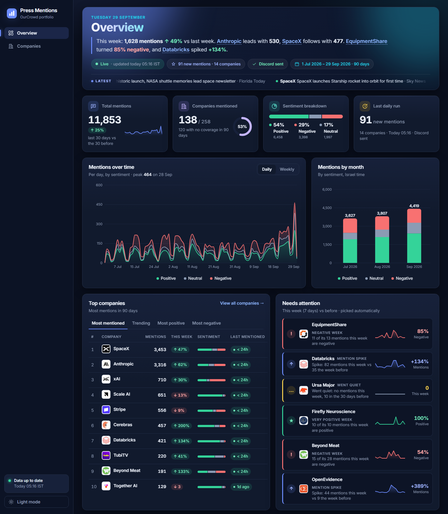
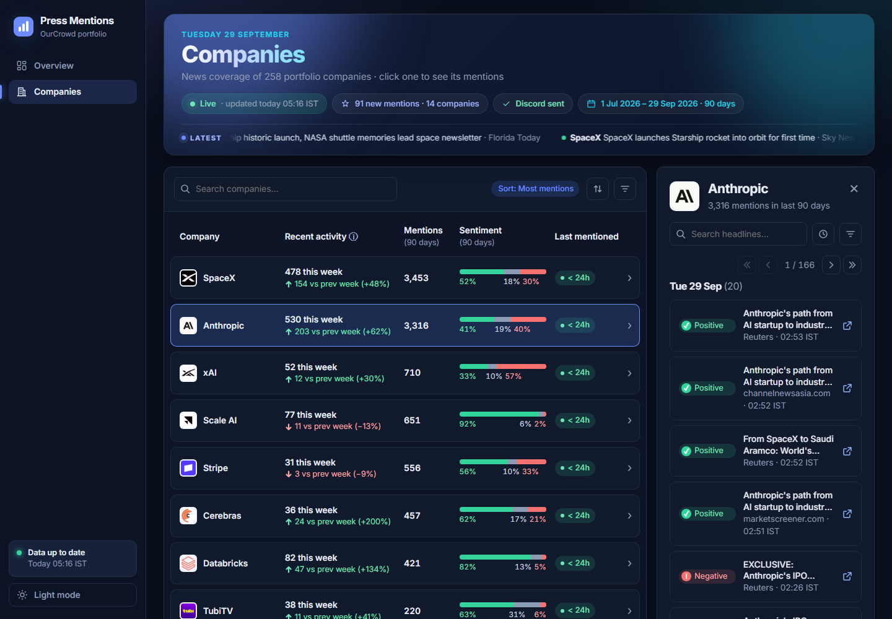
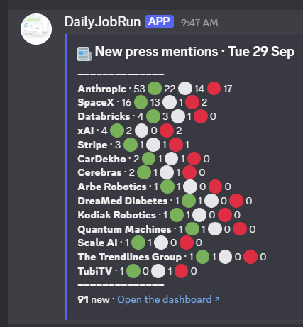
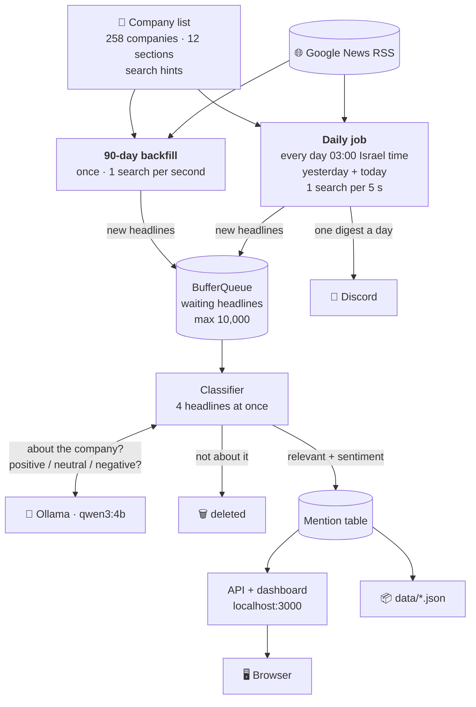
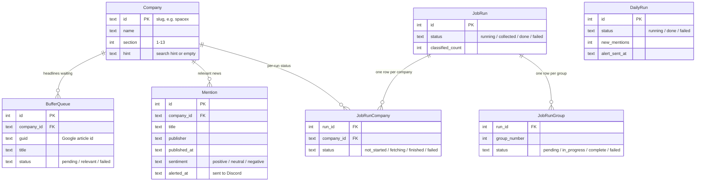
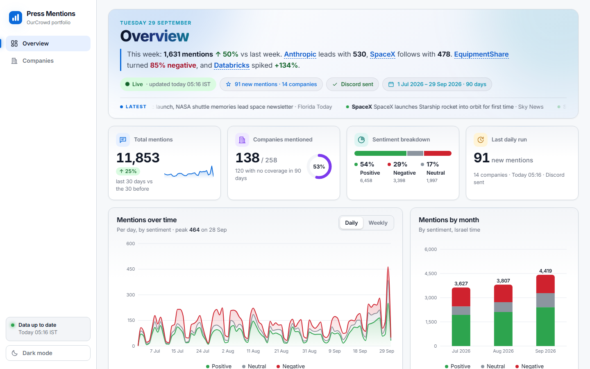

# Press Mentions Monitoring & Dashboard

**TL;DR:** every day the project searches Google News for 258 OurCrowd portfolio companies, and a **local Ollama model** (`qwen3:4b`) decides whether each headline is really about the company and whether the news is positive, neutral or negative. The results go to a dark-theme dashboard (90-day view per company) and a daily Discord digest. One command runs it all: `docker compose up -d`.

The owner's day-to-day steps are in [GUIDE.md](GUIDE.md). The design notes and the decision log (D-numbers) are in [PLAN.md](PLAN.md).

## Showcase

**TL;DR:** what you get after `docker compose up -d`: a live dashboard at http://localhost:3000 and one Discord message a day.


*The Overview page: the week in one sentence, the numbers, the charts, and the companies worth a look.*


*The Companies page: every company with its activity and sentiment; the clicked company's mentions open on the right.*



*The daily Discord digest (29 Sep 2026): 91 new mentions for 14 companies.*

## Contents

0. [Showcase](#showcase)
1. [What it does](#what-it-does)
2. [How it works](#how-it-works)
   - 2.1 [How to run](#how-to-run)
3. [Project layout](#project-layout)
4. [Database structure](#database-structure)
5. [Quick start with Docker (one command)](#quick-start-with-docker)
6. [The dashboard](#the-dashboard)
7. [The daily job and Discord digest](#the-daily-job-and-discord-digest)
8. [The `data/` folder](#the-data-folder)
9. [Tracking progress](#tracking-progress)
10. [News source: Google News](#news-source-google-news)
11. [The AI model (Ollama)](#the-ai-model-ollama)
12. [How classification quality was validated](#how-classification-quality-was-validated)
13. [Assumptions, trade-offs and limitations](#assumptions-trade-offs-and-limitations)
14. [Real run results](#real-run-results)
15. [Tech stack](#tech-stack)
16. [FAQ and where to find things](#faq-and-where-to-find-things)

## What it does

**TL;DR:** collect → classify with a local AI → store → show → alert daily.

For every company in `ourcrowd_companies.txt` (258 companies), the system:

1. **Collects** its news of the last 90 days from Google News.
2. **Classifies** each headline with a local Ollama model: is it about this company, and if so, is it positive, neutral or negative?
3. **Stores** the relevant mentions in SQLite (irrelevant ones are deleted).
4. **Shows** a dashboard: every company with its status ("last mentioned 3 days ago" / "no coverage"), its mentions (newest first, with sentiment and a link), and an Overview page of charts.
5. **Runs daily** at 03:00 Israel time: adds the new mentions, updates open dashboards, and sends one Discord message.

## How it works

**TL;DR:** separate processes that meet in one SQLite file; the database table is the queue.



- The collector, the classifier, the dashboard and the daily job are **separate processes**. One crash never stops the others.
- Every write is a short transaction, and every run can be **stopped and resumed** with no duplicates.
- Why each piece looks like this: [docs/design-challenges.md](docs/design-challenges.md).

### How to run

**TL;DR:** install Docker Desktop, then run one command in the project folder and open http://localhost:3000.

```
docker compose up -d
```

That starts everything: the AI (Ollama with `qwen3:4b`), the dashboard and the daily job. The step-by-step, the self-test and the everyday commands are in the guide:

- [GUIDE.md → Start everything with Docker](GUIDE.md#start-everything-with-docker): first start, step by step
- [GUIDE.md → Common commands](GUIDE.md#common-commands): stop, restart, logs, the backfill, progress
- [GUIDE.md → If something fails](GUIDE.md#if-something-fails)

More detail on the Docker setup: [Quick start with Docker](#quick-start-with-docker).

## Project layout

**TL;DR:** backend in `src/`, dashboard page in `web/`, results in `data/`.

| Path | What is in it |
|---|---|
| `src/collector/` | Google News search, date-window splitting, group processes |
| `src/classifier/` | The Ollama client, the prompt, the queue worker, the `data/` export |
| `src/daily/` | The daily job: scheduler, collect + classify, Discord digest |
| `src/api/` | Express API that serves the dashboard (read-only) |
| `src/supervisor/` | The orchestrator behind `npm start` |
| `src/seed/`, `src/db/`, `src/shared/`, `src/tools/` | Company list loader, database schema, shared helpers, `progress` and `docker:snapshot` tools |
| `src/config.js` | Every setting in one place (paces, limits, times, Overview thresholds) |
| `web/` | The dashboard page (React + Vite + Recharts); logos in `web/public/logos/` |
| `test/`, `web/src/**/*.test.*` | Backend tests (`node:test`) and page tests (Vitest) |
| `data/` | The committed results (JSON), see [below](#the-data-folder) |
| `db/` | The live SQLite database and logs (not in git) |
| `docker/`, `Dockerfile`, `docker-compose*.yml` | The Docker setup and the shipped database copy |
| `research/` | The model test and the parallel-speed test (data, scripts, results) |
| `queries/progress.sql` | Ready-made read-only SQL queries |
| `docs/` | Long reference: [LLM research](docs/llm-research.md), [design challenges](docs/design-challenges.md), [run results](docs/run-results.md), [operations](docs/operations.md) |
| `ourcrowd_companies.txt`, `filtered_ourcrowd_companies.txt`, `company_hints.json`, `section_keywords.json` | The company list, its 12 sections, search hints for 108 hard names, and the section words |

## Database structure

**TL;DR:** one SQLite file (`db/press-mentions.sqlite`) with 7 tables: 3 hold the data (companies, the queue, mentions) and 4 keep track of the runs.



| Table | Kind | What it is for |
|---|---|---|
| `Company` | Data | The 258 portfolio companies: name, section and the ready-made Google search. Loaded from the company list files |
| `BufferQueue` | Data | **The queue** between the collector and the AI: every new headline waits here until it is classified. Capped at 10,000 rows, so the collector pauses while the AI catches up |
| `Mention` | Data | **What the dashboard shows:** every headline the AI said is really about the company, with its sentiment. `alerted_at` marks what already went to Discord |
| `JobRun` | Tracking | One row per 90-day backfill: its status, a heartbeat (to spot a crash) and the counters (classified / relevant / deleted / failed) |
| `JobRunCompany` | Tracking | Each company's status in a backfill, so a stopped run resumes where it left off |
| `JobRunGroup` | Tracking | Each group of ~25 companies in a backfill, with its crash count, so one bad group never stops the others |
| `DailyRun` | Tracking | One row per daily run: new mentions and when Discord accepted the message. It is also how the job knows today's run already happened |

- A headline that is **not** about the company is deleted from `BufferQueue`; it never reaches `Mention`.
- The same article can't be stored twice for a company (`UNIQUE (company_id, guid)`).
- The full schema with comments: [`src/db/database.js`](src/db/database.js). Ready-made read-only queries: [`queries/progress.sql`](queries/progress.sql).

[↑ Back to contents](#contents)

<a id="0-the-fastest-way-docker-one-command"></a>

## Quick start with Docker

**TL;DR:** install [Docker Desktop](https://www.docker.com/products/docker-desktop/), then in the project folder run `docker compose up -d` and open **http://localhost:3000**. No Node, no Ollama, no model download by hand.

```
docker compose up -d
```

| Container | What runs in it |
|---|---|
| `ollama` | Ollama 0.34.4 with **`qwen3:4b` already inside the image**. Runs on the CPU, so it works on any computer |
| `app` | The **dashboard** (API + page, http://localhost:3000, this computer only) **and the daily job** (every day at 03:00 Israel time), side by side |

- **The data comes with it.** The image carries a copy of the database (258 companies, 12,016 mentions) and `data/`. The first start copies them into two Docker volumes (`db`, `data`), which survive restarts and rebuilds.
- **No double runs.** At start the daily job checks the last successful run. It runs at once only when that was more than 24 hours ago, then every day at 03:00.
- **Discord (optional):** copy `.env.example` to `.env` and set `DISCORD_WEBHOOK_URL`. Docker reads `.env` at start; it is never copied into the image.
- **First start:** 5–10 minutes (it downloads the ~2.5 GB model). Later starts take seconds. Disk: about **16 GB**.

**Step by step (first time):**
1. Install **Docker Desktop** and open it. Wait until it says **Engine running**. On Windows, accept WSL2 if asked and restart.
2. Make sure nothing else uses **port 3000**.
3. Open a terminal **in the project folder** (VS Code: **Terminal → New Terminal**; or PowerShell, then `cd <path to>\press-mentions-dashboard`).
4. Run `docker compose up -d`. It ends with `Container press-mentions-ollama-1 Healthy` and `Container press-mentions-app-1 Started`.
5. Open **http://localhost:3000**.

"docker is not recognized"? Close the terminal (or VS Code) and open a new one.

**Check that everything works:**

| # | Do this | You should see |
|---|---|---|
| 1 | Open http://localhost:3000, then click a company | The Overview page (hero with briefing and ticker, "138 / 258" companies mentioned, charts); the company opens on the Companies page with its mentions on the right |
| 2 | `docker compose ps` | Both `ollama` and `app` say **Up … (healthy)** (the app takes about 20 s) |
| 3 | `docker compose logs app` | `Dashboard: http://localhost:3000` and `Daily job started … runs every day at 03:00`. **No** "running now" line when the last daily run was less than 24 h ago. No "DISCORD_WEBHOOK_URL is not set" warning when `.env` has the webhook |
| 4 | `docker compose exec app node -e "import('./src/classifier/ollamaClient.js').then(async m => console.log(await m.createOllamaClient().selfCheck()))"` | `{ ok: true, detail: 'answer { "relevant": true, "sentiment": "positive" }' }`: the AI answers inside Docker (a few seconds the first time) |
| 5 | `docker compose exec app npm start`, then **Ctrl+C** | The backfill starts: "Last collection finished … the collector is not started", then `Ollama 0.34.4 is ready with qwen3:4b`. Ctrl+C stops only the backfill |
| 6 | `docker compose restart app`, wait ~20 s, refresh the page | The page works again with the same data |
| 7 | `docker compose down`, then `docker compose up -d` | Starts in seconds; the same data (it lives in the volumes) |
| 8 | When done: `docker compose down` | Everything stops; the data is kept |

**Good to know:**
- With the webhook in `.env`, Docker's daily job posts the real digest at 03:00.
- Every other command (progress, tests, snapshot) is in [GUIDE.md → Common commands](GUIDE.md#common-commands).
- `docker compose logs -f app` follows the logs; `docker compose down -v` deletes the volumes (the next start uses the shipped database again); `docker compose up -d --build` rebuilds after a code change.
- NVIDIA GPU (much faster): `docker compose -f docker-compose.yml -f docker-compose.gpu.yml up -d`.
- A full new backfill, all Docker commands, and why the dashboard and daily job share one container: [docs/operations.md](docs/operations.md#docker-extras).

[↑ Back to contents](#contents)

<a id="5-the-dashboard"></a>

## The dashboard

**TL;DR:** a dark, modern page (light mode too) at http://localhost:3000 with two pages, **Overview** and **Companies**, under a hero band with a briefing and a news ticker.


*The Overview page (dark mode): the week in one sentence, the numbers, the charts, and the companies worth a look.*


*The Companies page: every company with its activity and sentiment; the clicked company's mentions open on the right.*

<details>
<summary>Light mode</summary>



</details>

- **Side menu:** Overview, Companies, the data status, and the Light / Dark switch (remembered in the browser). On a phone it becomes a top bar. The page is in the address (`?page=companies`), so refresh and Back work.
- **Hero band (both pages):** the date and the page title; on the Overview a **briefing** written from the data (e.g. "This week: 1,657 mentions ↑ 55% vs last week. Anthropic leads with 535…", names open the company); **status pills** (Live / last update time, amber when over 26 h old, red when the last daily run failed; the last run's new mentions; Discord sent; the 90-day window); and a **ticker** of the newest 20 headlines (hover pauses it).
- **Overview:** four number cards (total mentions with a 30-day trend, companies mentioned "138 / 258", sentiment split, last daily run), **Mentions over time** (daily / weekly, stacked by sentiment), **Mentions by month**, **Top companies** (most mentioned / trending / most positive / most negative), **Needs attention** (a negative week, a spike, went quiet, a very positive week; limits in `src/config.js` → `OVERVIEW`), and **Recent mentions**.
- **Companies:** every company, also those with no coverage, most mentions first. Columns: logo + name, recent activity (this week vs the week before), mentions (90 days), sentiment bar, last mentioned ("3d ago", exact time on hover). Search as you type, sort (choose again to reverse) and filter (All / Mentioned this week / Mentioned / No coverage).
- **Mentions panel** (click a company): its mentions grouped by day (Israel time), 20 per page, each with sentiment, headline, publisher, time and a link. Filters: time range (24h / 7d / 30d / 90d), sentiment, headline search. The open company is in the address (`?company=spacex`), so a link opens it.
- **Always fresh:** "days ago" and the 90-day window are computed on every request, never stored. The page reloads itself when the daily job adds data, when you return to the tab, and at midnight.
- **This computer only:** the API listens on 127.0.0.1 and answers only `localhost` requests.
- API endpoints and troubleshooting: [docs/operations.md](docs/operations.md#the-api). Design decisions: D117 and D118 in [PLAN.md](PLAN.md).

[↑ Back to contents](#contents)

<a id="6-the-daily-job"></a>

## The daily job and Discord digest

**TL;DR:** it runs by itself inside the Docker `app` container. Every day at 03:00 Israel time it finds the new mentions, updates open dashboards, and sends one Discord message.


*A real digest from 29 Sep 2026: 91 new mentions for 14 companies. Each line is a company's new mentions, then 🟢 positive, ⚪ neutral, 🔴 negative.*

**One run:**
1. Waits if a 90-day collection is still running.
2. Searches every company for yesterday + today, **one search every 5 seconds** (about 22 minutes; 1 s got us blocked by Google for 2 hours, D108). Articles already stored are skipped.
3. Classifies the new articles with Ollama (same prompt and rules as the backfill).
4. Tells the API, so open dashboards reload with the new mentions.
5. Sends **one Discord message**: every company with new mentions, its count and 🟢 / ⚪ / 🔴 counts, most first, with the total and a dashboard link. A quiet day gets "☕ All quiet on the press front", so you know it ran.
6. Writes `data/` again and records the run in the `DailyRun` table.

**It handles failures:**
- Mentions are marked "alerted" only after Discord accepts the message. If Discord is down, they go out next time (at-least-once).
- Computer off or asleep at 03:00: the missed day runs at start, or within an hour after waking.
- Google or Ollama down: it waits and retries. A failed run is retried after 30 min (up to 3 times). After 3 hours of trouble, Discord gets one red "⚠️ Daily job problem" message.
- Only one daily job can be open at a time (lock file `db/daily.lock`). After a crash or a PC restart, Docker starts it again by itself (`restart: unless-stopped`).
- No webhook set: the job still runs, and the new mentions go out in the first message once the webhook is set.

How to check it ran, and what each Discord message means: [GUIDE.md → The daily job](GUIDE.md#the-daily-job). Step-by-step details: [docs/operations.md](docs/operations.md#the-daily-job-in-detail).

[↑ Back to contents](#contents)

## The `data/` folder

**TL;DR:** the results of a real run as JSON, readable on GitHub without running anything.

| File | What is in it |
|---|---|
| [`data/companies.json`](data/companies.json) | Every company with its status: last mentioned date and "days ago", or "no coverage" |
| [`data/mentions.json`](data/mentions.json) | Every relevant mention of the last 90 days: title, link, publisher, date, sentiment |
| [`data/run.json`](data/run.json) | Run summary: counts (classified / relevant / deleted / failed), groups, failed companies, and `lastDailyRun` (the latest daily run) |

- Written by the classifier after each group and at the end of a run, and by the daily job after each run with new mentions.
- Each file is written to a temp file and renamed, so it is never half-written.
- An empty database imports `data/` automatically when the dashboard starts.

## Tracking progress

**TL;DR:** the how-to is in the guide: [GUIDE.md → Follow a run](GUIDE.md#follow-a-run) and [Check things in the database](GUIDE.md#check-things-in-the-database).

- **Quick summary:** `docker compose exec app npm run progress` (run status, companies, groups, queue, mentions).
- **Live logs:** `docker compose logs -f app`.
- **Deeper:** ready-made read-only SQL in [`queries/progress.sql`](queries/progress.sql); log rules and example output in [docs/operations.md](docs/operations.md#tracking-progress-and-logs).

[↑ Back to contents](#contents)

## News source: Google News

**TL;DR:** the free Google News RSS search feed, with date filters, section words and search hints; undocumented and limited to ~100 results per search.

**Why:** Google's News API was shut down in 2016, the Custom Search API is closed to new customers, and paid wrappers cost money far below our volume. The RSS search feed (`news.google.com/rss/search?q=...`) is free, needs no key and returns Google's news results.

**How we search:**
- Each company gets one search: its name (or a **hint** such as "Harvey AI" for 108 hard names) plus a few **section words** (e.g. `(company OR AI OR …)`), e.g. `after:2026-07-01 before:2026-07-15 "Harvey AI" (company OR AI OR …)`. In a test, "Harvey" alone gave 25 real articles out of 100; with context, 86.
- A search returns at most ~100 results, so a full window (95+) is **split in half**, down to single days.
- One request at a time: 1 s apart for the backfill, 5 s for the daily job. Growing waits on 429 / 5xx / CAPTCHA; a company is marked failed only after three 4xx rejections.
- Duplicates are blocked per company by Google's article ID, with publisher + title as a backup.

**Limitations:**
- The feed is undocumented and could change. Its terms are for personal, non-commercial readers and `robots.txt` disallows it; we accept this knowingly for a non-commercial take-home.
- Completeness is limited to what Google returns; a very big company can still hit 100 articles in one day.
- **No article text:** only the headline and publisher. Links are `news.google.com` redirects (they open the real article); decoding them would cost 2 extra requests per article.
- Former company names are not searched.

Full reasoning, per problem: [docs/design-challenges.md](docs/design-challenges.md) (challenges 1–4, 10, 11).

[↑ Back to contents](#contents)

## The AI model (Ollama)

**TL;DR:** `qwen3:4b` on local Ollama, one call per headline, strict JSON answer `{"relevant": true|false, "sentiment": "positive"|"neutral"|"negative"|null}`.

**Which model and why:** we tested 4 models that fit an 8 GB GPU on 598 real headlines. `qwen3:4b` was the only one high on all three measures, so it won over the faster `llama3.2:3b` (which missed 1 in 8 real articles and got sentiment right only 62% of the time):

| Model | Relevance precision | Relevance recall | Sentiment accuracy | Articles/s |
|---|---|---|---|---|
| llama3.2:3b | 96.2% | 87.9% | 62.3% | 5.54 |
| **qwen3:4b** | **97.7%** | **97.7%** | **82.2%** | 3.06 |
| gemma3:4b | 80.4% | 99.8% | 84.4% | 3.67 |
| qwen3.5:9b | 86.2% | 100% | 83.8% | 1.57 |


*The 4 models side by side. Compare the three bars: only qwen3:4b is high on all three.*

Bigger models (e.g. `gpt-oss:20b`, `gemma4:26b`) don't fit in 8 GB and run partly on the CPU (about 13 h for the backfill), so they were excluded:


*The red line is the 8 GB of GPU memory. Only the 4 green models fit, so only they were tested.*

<details>
<summary>More charts: speed, and where junk slipped through</summary>


*Estimated time for a 20,000-article backfill, one request at a time. qwen3:4b (green) needs about 1.8 hours.*


*Relevance precision per company. Astra is red for every model: 93 of its 100 headlines were about OpenAI's "GPT-6 Astra". In the real system the search hint "Astra Space" keeps most of this out.*

</details>

**How it is invoked** ([`src/classifier/prompt.js`](src/classifier/prompt.js), [`src/classifier/ollamaClient.js`](src/classifier/ollamaClient.js)):
- `POST /api/chat` to Ollama, one user message per headline, `temperature: 0`, `think: false`, answer capped at 64 tokens.
- `format` = a **JSON schema**, so the model can only answer in that shape. Every answer is also checked; a bad one is retried, and after 3 failed rounds the article is set aside as failed.
- **Prompt structure:** the role ("You check news headlines for a press-mentions monitor"), then `Company`, `Section` (the full section name, e.g. `Health (Healthcare & Biotechnology)`), `Headline` and `Publisher`, then the task: (1) is it really about the company (with rules for same-name people, products and companies), (2) if yes, the tone with examples of positive / negative / neutral, and "answer with JSON only".
- Not relevant → the article is deleted. Relevant → saved as a mention with its sentiment.
- **Speed:** 4 requests at once (`LLM_CONCURRENCY` = `OLLAMA_NUM_PARALLEL` = 4) was 1.66× faster with the same accuracy.

Full research (benchmarks searched, excluded models, per-company results, the parallel test, how to reproduce): [docs/llm-research.md](docs/llm-research.md).

[↑ Back to contents](#contents)

## How classification quality was validated

**TL;DR:** 598 real Google News headlines with reference answers written before any model ran; `qwen3:4b` agreed on 97.7% precision / 97.7% recall for relevance and 82.2% for sentiment.

- **Data:** 598 real headlines (not synthetic) for 6 companies from the 6 largest sections, mixing confusing names (Harvey, Astra, Lemonade) and unique ones (OpenEvidence, Beyond Meat, Klook). Files: [`research/model-test/`](research/model-test/).

  
  *The test data per company. Grey = not about the company (only 7 of Astra's 100 headlines are).*
- **Reference answers:** written by an AI (Claude) with fixed [labeling rules](research/model-test/labeling-rules.md), from the headline and publisher only, before any model ran.
- **Method:** the same prompt, JSON schema, temperature 0 and thinking off for every model; scored on relevance precision and recall, sentiment accuracy, valid JSON and speed. All models returned 100% valid JSON.
- **The production prompt** (company + section name instead of a hand-written description): precision 96.6%, recall 97.4%, sentiment 80.7%, still above the 95% precision target. Running 4 at once didn't change accuracy.
- **In the real run:** 16,933 headlines classified, **0** without a valid answer.
- **Limits:** the reference answers are AI-made (a human spot-check is advised), only 6 companies were tested, and the model sees the headline only.
- Visual summary: [`research/model-test/results-page.html`](research/model-test/results-page.html). All numbers: [`research/model-test/summary.md`](research/model-test/summary.md).

## Assumptions, trade-offs and limitations

**TL;DR:** precision over recall, headlines only, a free but unofficial news feed, and a local, single-computer setup.

**Assumptions**
- The seed list is the source of truth; section and hint files were prepared once by hand.
- "The last quarter" = a rolling 90-day window, computed on every request (old data is filtered, not deleted).
- Discord is the alert channel (visible, easy to set up with a webhook).
- A headline + publisher is enough to judge relevance and tone.

**Trade-offs**
- **Precision over recall:** a wrong article on the dashboard hurts trust more than a missed one.
- **Irrelevant articles are deleted**, not kept, so the database only holds what is shown.
- **SQLite as the queue** (no Redis): the queue is capped at 10,000 rows, so the collector pauses while the AI catches up.
- **Our own small supervisor** instead of PM2: nothing extra to install; PM2 would be the choice in production.
- **Express** for speed of building; Fastify would be a better production choice.
- **Alerts are at-least-once:** a crash between sending and marking may repeat a mention in the next digest.

<a id="12-crashes-and-failures"></a>

**How failures are handled:** a failed search is retried on the same company; a crashed process is restarted by the supervisor; every run is resumable from a lock + heartbeat + per-company checklist; a crash stays inside its group of ~25 companies. Full detail: [docs/design-challenges.md → Crashes and failures](docs/design-challenges.md#12-crashes-and-failures).

<a id="known-limitations"></a>

**Known limitations**
- Google News RSS limits (see [News source](#news-source-google-news)).
- AI-made reference answers, 6 test companies, headline-only classification.
- The daily "last 24 hours" is really yesterday + today (Google takes dates only); duplicates are skipped, so nothing is counted twice.
- The daily job re-checks yesterday's irrelevant articles (they were deleted); a few extra AI checks a day.
- `data/` is rewritten only on days with new mentions; the dashboard itself is always current.
- With 6+ dashboard tabs in one browser, the live-update connections can slow page loads.
- No login and no company editing; the API is reachable from this computer only.
- Several processes share one SQLite file: fine at this write rate, not for many writers.

[↑ Back to contents](#contents)

## Real run results

**TL;DR:** the first full run (28 Sep 2026) took 58 minutes: 258 / 258 companies, 16,933 articles checked, 11,600 relevant mentions, zero failures.

| | |
|---|---|
| Articles classified | 16,933 (68.5% relevant, 31.5% deleted) |
| Sentiment | 54.5% positive, 28.9% negative, 16.6% neutral |
| Companies with mentions | 136 of 258 (138 after the first daily runs) |
| Top companies | SpaceX 3,341, Anthropic 3,212, xAI 711, Scale AI 654, Stripe 561 |
| Failures | 0 companies, 0 groups, 0 Google errors, 0 invalid AI answers |
| Machine | A home Windows 11 PC with a local GPU, `qwen3:4b`, 4 at once |

The AI is the bottleneck (searching took ~16 min), and the queue cap worked: the collector paused twice and went on by itself. Timeline, per-group, per-section and publisher tables: [docs/run-results.md](docs/run-results.md).

## Tech stack

**TL;DR:** Node.js 24, SQLite, Ollama, Express, React + Vite.

| Part | Choice | Why |
|---|---|---|
| Runtime | Node.js 24 | Required by the brief |
| Database | SQLite via built-in `node:sqlite` | Relations, unique rules against duplicates, transactions; one file, no server |
| News source | Google News RSS search | The only free, structured access to Google's news results |
| LLM | Ollama, `qwen3:4b` | Local model required; chosen by our own test |
| Orchestration | Own small supervisor; the database is the queue | No extra server or tool to install |
| API | Express | Fast to build |
| Frontend | React + Vite, TanStack Query, Recharts | List → detail view, charts, fast dev server |
| Scheduling | node-cron (03:00 Asia/Jerusalem) | Runs inside the Docker `app` container |
| Alerts | Discord webhook | Visible, free, simple |
| Tests | `node:test` (460) and Vitest (126), with fakes for Google, Ollama and Discord | Offline and fast |
| Delivery | Docker Compose | One command, runs anywhere |

## FAQ and where to find things

**TL;DR:** quick answers and pointers (to just see it: `docker compose up -d`, then http://localhost:3000).

- **I don't want to run anything.** Read the [`data/`](data/) JSON files, and [docs/run-results.md](docs/run-results.md).
- **Where are the settings?** `src/config.js` (all defaults); `.env` to override (see `.env.example`).
- **Why wasn't a company found?** Check its search hint in `company_hints.json` and its section in `filtered_ourcrowd_companies.txt`; about half the companies simply had no coverage in 90 days.
- **How do I re-collect a failed group?** `docker compose exec app npm start -- --groups 2,5` (see [operations](docs/operations.md#the-90-day-collection-npm-start)).
- **Day-to-day steps for the owner:** [GUIDE.md](GUIDE.md).
- **Why was X decided?** [PLAN.md](PLAN.md) (decision log, D-numbers).
- **The AI prompts used to build this project:** [`prompts/ai-assistant-prompts.md`](prompts/ai-assistant-prompts.md).

[↑ Back to contents](#contents)
