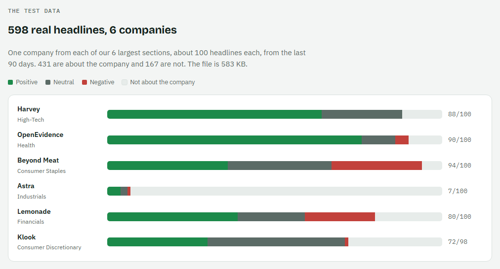
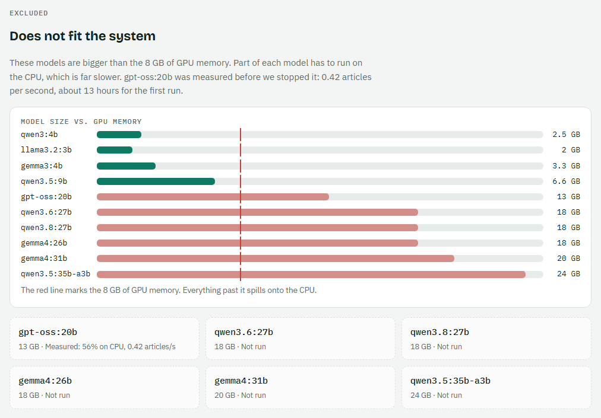
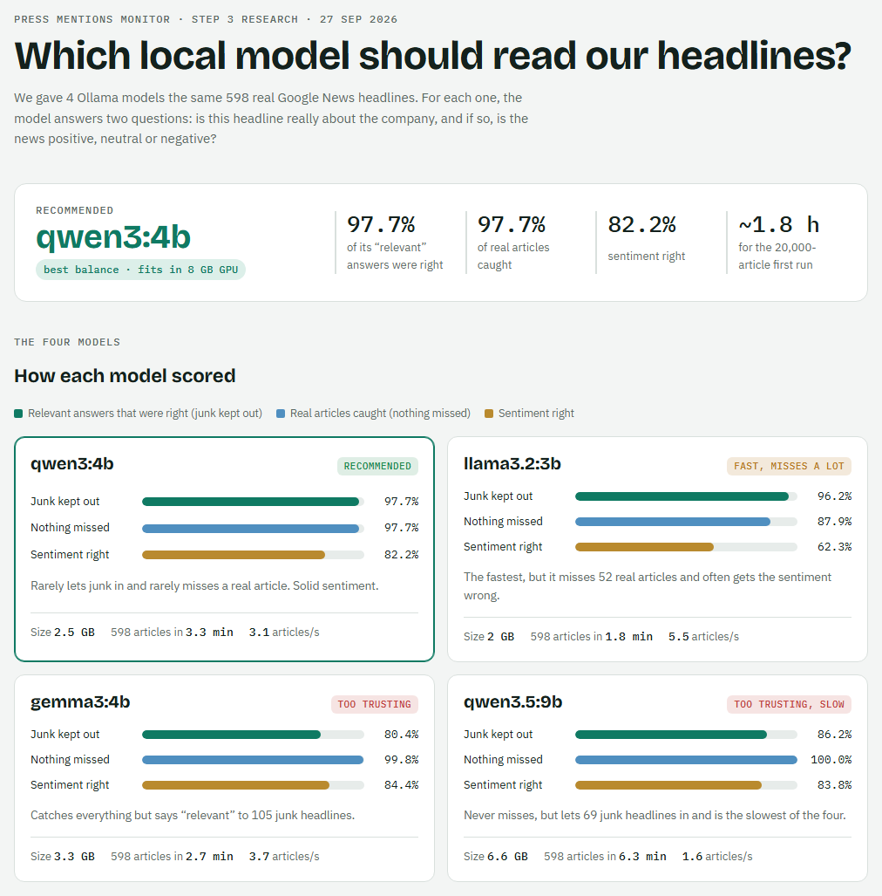
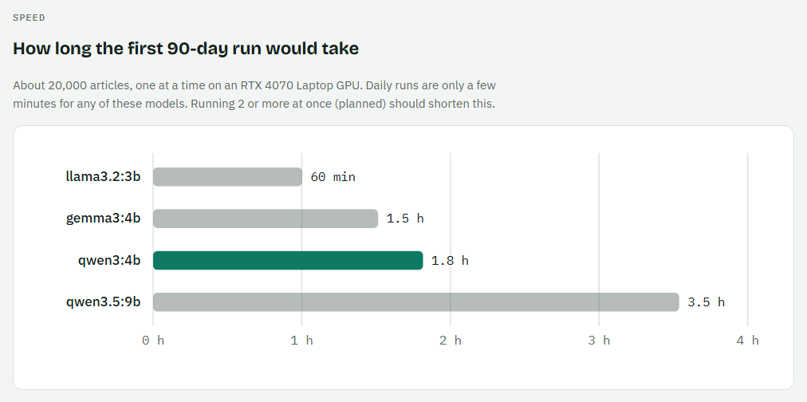
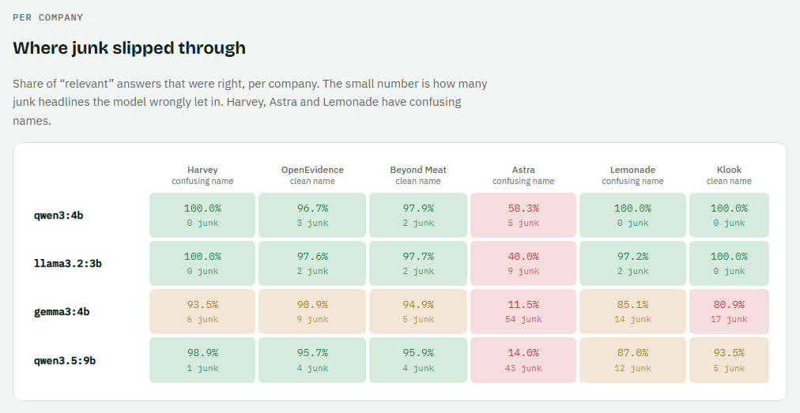

# Press Mentions Monitoring & Dashboard

> **Status: work in progress.** Built: data collection, classification and the orchestrator ([how to run](#how-to-run)). Next: the API + dashboard, then the daily job and alert.
> Full design notes and the decision log are in [PLAN.md](PLAN.md).

## What it does

For every company in `ourcrowd_companies.txt` (258 companies), the system:

1. **Collects** its news from the last 90 days from Google News.
2. **Classifies** each article with a **local Ollama model**: is it really about this company, and if so, is it positive, negative or neutral?
3. **Stores** the relevant mentions in SQLite.
4. **Shows** a dashboard: every company with its status ("last mentioned 3 days ago" / "no coverage found"). Click a company to see its mentions, newest first, each with its sentiment and a link to the article.
5. **Runs daily**, adds new mentions, and sends one alert listing them (the daily job: planned, not built yet).

## How it works

```
ourcrowd_companies.txt (258 companies) → filtered_ourcrowd_companies.txt (12 sections + 13 Unsorted) + company_hints.json (search hints for 108 hard names)
        │
        ▼
1. DATA COLLECTION ◄──► Google News RSS  (one company at a time, paced;
        │                 search = company hint or name + section words)
        │  each search result = one chunk; waits while the queue is full
        ▼
2. BUFFER QUEUE (SQLite table)   articles waiting for the LLM
        │  batches
        ▼
3. CLASSIFICATION ◄──► Ollama (local)
        │  not about the company → deleted
        │  about the company     → sentiment → moved in chunks
        ▼
4. MENTION TABLE (SQLite) ──► data/ (JSON export of the run)
        │
        ▼
5. API (Express) ──► 6. DASHBOARD (React + Vite)

`npm run collect` runs the 90-day collection. The daily job (one alert with the new mentions) is a separate job, designed later.
Collection (1), classification (3) and the API (5) are separate services, kept alive by a small supervisor.
```

## How to run

### 1. What you need
- **Node.js 24** or newer.
- **Ollama** (local AI), with the model downloaded once:
  ```
  ollama pull qwen3:4b
  ```
- **Ollama set to answer 4 requests at once** (measured to be the best speed, see [LLM research, section 7](#7-speeding-up-the-llm-parallel-requests)). Set it once, then restart the Ollama app:
  - Windows (PowerShell): `[Environment]::SetEnvironmentVariable('OLLAMA_NUM_PARALLEL','4','User')`, then quit Ollama from the tray icon and start it again.
  - macOS / Linux: `export OLLAMA_NUM_PARALLEL=4` in the shell that starts `ollama serve`.
  - GPU memory: with 4 at once the model uses about **5.1 GB** (62% of an 8 GB card). For less, use 3 (about 4.5 GB, 55%): set `OLLAMA_NUM_PARALLEL=3` **and** `LLM_CONCURRENCY=3` in `.env`. The two numbers must match.
- An internet connection (Google News).

### 2. Install
```
git clone https://github.com/avichickvashvili-droid/press-mentions-dashboard.git
cd press-mentions-dashboard
npm install
```

Optional: copy `.env.example` to `.env` to change a setting (database path, number of parallel AI requests, Ollama address or model). Without a `.env` file the defaults are used, and Node prints `.env not found. Continuing without it.`. That line is expected.

### 3. Run
```
npm start
```
This starts the **orchestrator**, which runs two services side by side and restarts them if they crash:

| Service | What it does | How long (on the dev PC) |
|---|---|---|
| `[collector]` | Searches Google News for all 258 companies over the last 90 days (1 request per second) and puts each article in the queue | About 10–30 minutes of searching. It pauses whenever the queue is full (10,000), so on a big backfill it finishes close to the classifier |
| `[classifier]` | Asks the local AI about each article: relevant? sentiment? Deletes the irrelevant ones, saves the rest as mentions | Keeps pace with the collector, then about 1–2 hours to finish the queue |

When the queue is empty, the classifier writes the results to **`data/`** and the run is marked `done`:
- `data/companies.json`: every company with its status ("mentioned N days ago" or "no coverage").
- `data/mentions.json`: every relevant mention: title, link, publisher, date, sentiment.
- `data/run.json`: run summary (articles checked, relevant, deleted, failed companies).

The database itself is `db/press-mentions.sqlite` (never committed to git).

**Stopping and resuming.** Press **Ctrl+C** to stop. Each service saves where it was first. Run `npm start` again and it continues from the same company, with no duplicates. The same happens after a crash or a power cut.

**Running again.** The 90-day collection runs **once**. After it has finished, `npm start` doesn't collect again (new articles will come from the daily job, not built yet). To force a new 90-day collection, run `npm run collect`.

### 4. Other commands

| Command | What it does |
|---|---|
| `npm test` | Runs all 160 tests. Offline: Google News and Ollama are replaced with fakes |
| `npm run collect` | Runs only the collector: one full 90-day collection (or resumes an unfinished one) |
| `npm run classifier` | Runs only the classifier (always on; stop with Ctrl+C) |
| `npm run seed` | Only loads or updates the company list in the database |

Each service ends with an exit code that says why it stopped (0 finished, 3 refused because another run is active, 1 crashed); see [challenge 12](#12-crashes-and-failures).

## Tech stack

| Part | Choice | Why |
|---|---|---|
| Runtime | Node.js 24 | Required by the brief |
| Database | SQLite via built-in `node:sqlite` | We need relations between tables, unique rules to block duplicates, and transactions so chunk writes are all-or-nothing. It's a single file with no server and no install |
| News source | Google News RSS search feed | The only free, structured access to Google's news results |
| LLM | Ollama (local), model **`qwen3:4b`**, chosen by research ([see below](#llm-research-model-choice-and-validation)) | Required by the brief: a local model for all text understanding |
| Orchestration | 3 independent services (api, collector, classifier) + our own small supervisor; the daily job is a separate job (designed later) | The database already is the queue, so a queue library would add a server (Redis) for nothing. Separate processes mean one crash doesn't affect the others |
| API | Express | Fastest to build in a time-limited task. *For a production API, Fastify would be the better choice* (built-in validation and logging) |
| Frontend | React + Vite | List → click → detail view; fast dev server |
| Tests | `node:test` (built in) with fakes for Google News and Ollama | Tests run offline and fast |

---

## System challenges, solutions and trade-offs

Each design choice solves a specific problem. For each one: the problem, what we do about it, and what it costs.

### 1. There is no official Google News API
- **Problem:** Google shut down its News API in 2016. The Custom Search API is closed to new customers. Paid wrappers (SerpApi etc.) cost money after 100–250 searches, far below our ~7,700 searches/month.
- **Solution:** use the **Google News RSS search feed** (`news.google.com/rss/search?q=...`). It's free, needs no key, and returns Google's news results.
- **Trade-offs:**
  - The feed is undocumented and could change or break at any time.
  - Its terms say it's for personal, non-commercial feed readers, and Google's `robots.txt` disallows it. We accept this knowingly for a non-commercial take-home and document it here.
  - Results come from Google News (news.google.com). They may differ slightly from the "News" tab of Google Search.

### 2. Each search returns only ~100 results
- **Problem:** one RSS search returns about 100 articles at most, with no next page. For a big company like Anthropic, that covers only the last ~3 days, not 90.
- **Solution:** **split the time range.** The feed supports date filters (`after:` / `before:`, tested). We start with one 90-day window per company, and any window that comes back full (≥95 results) is split in half, down to single days. Windows overlap slightly because Google's date edges are fuzzy by about a day.
- **Trade-offs:**
  - More requests for big companies.
  - A very big company can still hit 100 articles in a *single day*. That is an accepted ceiling.
  - Completeness is limited to what Google returns (known limitation).

### 3. Google blocks aggressive scraping
- **Problem:** Google publishes no rate limit. Going too fast leads to HTTP 429 errors, CAPTCHA pages or temporary IP blocks.
- **Solution:**
  - One request at a time, **1 second apart** with a little random jitter.
  - On 429 or CAPTCHA, **back off exponentially** (wait longer each time), then retry the same company until it's done.
  - On 403 (blocked), wait 5 s for the first 3 tries, then use the same growing waits (up to 10 min), so a real block isn't hammered.
  - Companies are fetched **one at a time**.
- **Trade-offs:**
  - 1 second is faster than the 3–5 seconds commonly reported as safe, so a block is more likely. We accept that risk for faster daily runs (a few minutes of collection instead of ~15–20), and the backoff handles blocks when they happen.
  - During the 90-day backfill the local LLM is the slow part, so the faster pace barely changes the total time (a few hours).

### 4. Ambiguous company names bring junk results
- **Problem:** names like *Harvey*, *Island*, *Silo*, *Bites*, *Rewire*, *Glean* are everyday words, and *Groq* collides with xAI's *Grok*. Searching the bare name returns mostly unrelated articles.
- **Solution, in three layers:**
  1. **12 industry sections.** Each company is placed in one section (`filtered_ourcrowd_companies.txt`), and each section adds a few context words to the search:
     - High-Tech (Information Technology)
     - Health (Healthcare & Biotechnology)
     - Sports, Fitness & Entertainment
     - Financials (Banking & Insurance)
     - Consumer Staples (Essential Goods)
     - Consumer Discretionary (Luxury & Leisure)
     - Industrials (Manufacturing & Logistics)
     - Communication Services
     - Energy
     - Utilities
     - Materials
     - Real Estate
  2. **Search hints for the hard names.** Some companies need more than section words, so they get a hint used in the search: the name the press actually writes ("Harvey AI", "Wave Financial", "Launchpad Build AI"), a product, a founder, or a very specific word. Unique names like *Cerebras* need no hint. The hints live in `company_hints.json`: 108 of the 258 names needed one.
     - Example: `after:2026-06-29 before:2026-09-28 "Flash Forest" (section words)`, or, with a hint, `after:… before:… "Peak AI" (section words)`. The date part always goes first.
     - **How the three files come together:**
       ```
       filtered_ourcrowd_companies.txt   company_hints.json    section_keywords.json
         Harvey → section 1                Harvey → "Harvey AI"  1 → (company OR AI OR …)
                  └──────────────────────────┬─────────────────────────┘
                                             ▼
                        SEED LOADER (collector's first step at start-up)
                                             ▼
                  Company table: query_param = "Harvey AI" (company OR AI OR …)
                                             ▼
                  COLLECTOR: date window + query_param → Google News
       ```
     - **How it's wired:** at start-up a small seed loader reads the three files (`filtered_ourcrowd_companies.txt`, `company_hints.json`, `section_keywords.json`), builds each company's search once, and saves it in the database. The collector reads that search and puts the date window at the front, e.g. `after:2026-07-01 before:2026-07-15 "Harvey AI" (company OR AI OR …)`. Edit a file and the searches are rebuilt on the next start.
     - **Why:** fewer junk articles enter the queue, so the LLM checks fewer articles (less load on the slowest stage) and more of the 100 results per search are real. In our test, the plain search "Harvey" gave 25 real articles out of 100, and the search with context gave 86.
  3. **LLM relevance check.** The local model confirms that each article is really about *this* company before it counts.
- **Trade-offs:**
  - We favor **precision over recall**: a wrong article on the dashboard hurts trust more than a missed one, so some real mentions may be filtered out.
  - Every company has to be assigned a section, and hard names need a hint that was researched by hand. A new company with a confusing name needs a hint added.
  - A hint that is too narrow can drop real articles that don't use it.

### 5. Throughput: collection is much faster than the LLM
- **Problem:** the stages run at very different speeds:
  - The collector brings in up to ~20–30 articles/second, even with pacing.
  - The local LLM handles about 3–4 articles/second.
  - Left alone, unclassified articles would pile up.
- **Solution: a buffer queue with a cap.**
  - Fetched articles go into a **BufferQueue table** in SQLite.
  - Each search result is inserted as **one chunk**, and only if the whole chunk fits under the **CAP**. Example: with CAP 10,000 and 9,999 waiting, a chunk of 100 waits until the queue drops to 9,900.
  - The collector **holds** while the queue is full and the LLM catches up.
  - The collector and classifier are separate services that meet only in this table. No queue library is needed.
  - **Speeding up the LLM: parallel requests (measured on REAL DATA).** The classifier sends **4 articles to Ollama at the same time** (Ollama's `OLLAMA_NUM_PARALLEL` = 4, plus 4 workers in the classifier, `LLM_CONCURRENCY`). We measured 1 to 8 at once on the 598 real headlines: 4 at once is **1.66× faster** (2.45 → 4.08 articles/s) with the same accuracy, taking the ~20k-article backfill from about 2.3 h to 1.4 h. Details: [LLM research, section 7](#7-speeding-up-the-llm-parallel-requests).
- **Trade-offs:**
  - The collector sometimes sits idle.
  - Parallel requests don't scale for free: each one uses extra GPU memory, and on one GPU the gain is usually well below 2× per doubling. Too many can push the model partly onto the CPU and make it slower. Workers must never pick the same article, so each worker claims its rows in the queue first.
  - The CAP is **10,000** rows, and relevant rows move to the Mention table **1,000 at a time**. The CAP must be at least the largest chunk (~100), or the loop would wait forever.
  - The CAP limits the *queue*, **not** the number of mentions: every relevant mention is kept.

### 6. Memory: articles piling up in RAM
- **Problem:** holding thousands of waiting articles in memory risks running out of memory, and a crash would lose them.
- **Solution:**
  - The queue lives **in the database, not in RAM**. The queue size is simply the number of rows in BufferQueue.
  - Collection runs **one company at a time** (no parallel fetches).
- **Trade-off:** a DB count before each chunk, which is cheap with an index and happens once every few seconds.

### 7. Database write load
- **Problem:** writing each article or LLM result individually means thousands of tiny writes, and writing everything at once is a risk.
- **Solution:** **all writes are chunked, and each chunk is one transaction:**
  - one search result per insert
  - one LLM batch per update
  - one group of relevant articles per move from BufferQueue to Mention
- **Trade-off:** results show up in batches rather than instantly. Fine for a daily job.

### 8. The local LLM is slow for a 90-day backfill
- **Problem:** roughly 10k–20k candidate articles × up to 2 questions each could take hours on a local GPU.
- **Solution:**
  - **One end-to-end step per article:** first "is it about the company?"; if not, the sentiment question is skipped and the article is deleted.
  - **Classify once:** a stored article is never sent to the LLM again.
  - The run is **resumable**, so an interruption loses no finished work.
- **Trade-off:** the first backfill is still long (hours). Later daily runs only handle ~1/90 of that.

### 9. Irrelevant articles
- **Problem:** keeping every rejected article grows the database with data we never show.
- **Solution:** irrelevant articles are **deleted**. The daily search covers only the last ~24 hours, so the same article rarely comes back.
- **Trade-offs:**
  - Google's fuzzy date edges and reruns after a crash can occasionally bring a rejected article back for one more LLM check.
  - We don't keep rejected samples in the database. For validation, the samples are collected separately.

### 10. Duplicates
- **Problem:** the same article can arrive again: tomorrow's search, overlapping date windows, a rerun after a crash, or a different search query.
- **Solution: two checks at insert time, across both tables:**
  1. **Same company + same Google article ID (`guid`)** = duplicate.
     - Tested: the same search run twice gave 100/100 identical guids.
     - Different searches gave 16/17 identical.
  2. **Backup: same company + same publisher + same title** = duplicate.
- **Why not publisher + date?** We tested it: Google often rounds publication times (e.g. `07:00:00 GMT`), and 22 *different* articles in our sample shared publisher + date. Title is what tells same-day articles apart.
- **Trade-offs:**
  - Google doesn't document that guids are stable (we measured instead).
  - Two genuinely different articles with an identical title from the same publisher would be merged. That's rare.
- **Not duplicates:** an article about two companies is one mention *per company*. The same story syndicated on different sites counts separately, since each is a real press appearance.

### 11. Google links are not the real article URL, and there's no snippet
- **Problem:**
  - RSS links are Google redirect pages (`news.google.com/rss/articles/...`), not the publisher's URL.
  - The "description" field is not a real snippet, just the title and publisher again.
- **Solution:**
  - We **keep the Google link**. It opens the real article in a browser (checked by hand).
  - Decoding it into the publisher URL (e.g. `politico.com/...`) was tested and works, but it costs 2 extra Google requests per article: about 20,000 requests and 5.5 hours for the backfill, plus a higher risk of being blocked. Not worth it (D60).
  - The LLM classifies from the **title** (and publisher).
- **Trade-offs:**
  - Links show `news.google.com` instead of the publisher's site; the publisher name is shown next to each mention.
  - Classifying from titles only is less accurate than full text. The model choice and validation take this into account.

### 12. Crashes and failures
- **Problem:** long runs meet real failures: the internet drops, Google blocks, Ollama stops, the PC restarts, the model returns garbage.
- **Why it matters:** the collector, classifier and database writes together carry the whole throughput. If one process ran everything, one crash would stop it all.
- **Solution: 3 independent services + a supervisor, with 4 layers of protection.**
  ```
  npm start
    └─ orchestrator  (restarts any service that dies)
         ├─ collector    → 90-day search → BufferQueue
         ├─ classifier   → BufferQueue → Ollama → Mention → data/
         └─ api          → API + dashboard   (next step, not built yet)
  ```
  1. **One item fails → retry it.** A temporary Google error (no internet, 429, timeout) is retried on the **same company until it's done**, with growing waits capped at ~10 minutes. A permanent error (e.g. a malformed query) marks that company `failed` and is reported. Invalid LLM JSON is retried, then marked `failed`.
  2. **A loop fails → only that loop restarts.**
  3. **A process dies → the supervisor restarts only that service.** The others keep running: if the internet drops, the collector waits **while the classifier keeps working through the queue**. A service that keeps crashing is stopped with a clear error instead of looping forever. An article that crashes the classifier is counted *before* processing; after a crash the articles are retried one at a time, so only the one that really causes it reaches 3 tries and is set aside as `failed`.
  4. **After a restart → resume, don't start over.** A `JobRun` table (a lock + a heartbeat written every 5 minutes. On a crash or stop, the service writes one last **emergency heartbeat** with the error, which releases the lock so the restart resumes at once. If even that can't be written, e.g. on power loss, a dead owner process is detected at once and a frozen one after 15 minutes without a beat) and a per-run company checklist (`JobRunCompany`, each company `not_started` → `fetching` → `finished`, or `failed`) record where we stopped. The collection job ends when every company is `finished` or `failed`. Every write is a transaction and inserts skip existing rows, so redoing the interrupted company is safe.
  - The services share only the SQLite file. There's **no database service**: SQLite is a file, not a server, so there's nothing to crash.
  - **Exit codes** tell the orchestrator why a service stopped, so it only restarts real crashes:

    | Code | Meaning | What the orchestrator does |
    |---|---|---|
    | `0` | Finished normally (e.g. the collection is done) | Doesn't restart it |
    | `3` | Refused to start, nothing wrong (another live process holds the run, or the previous run is still being classified) | Logs the reason, doesn't restart it |
    | `1` | Crashed | Restarts it: 1 s → 2 s → 5 s → 10 s → 30 s → 60 s; more than 5 crashes in 10 minutes → gives up on that service with a clear error |
    | `130` | Stopped with Ctrl+C | Expected during shutdown |
    | `143` | Stopped by a stop request | Expected during shutdown |
  - **Every stop or restart writes the emergency heartbeat first.** The orchestrator sends the service a "stop" message (Windows has no soft stop signal between programs), the service writes its last heartbeat to the database and exits, and only if it hasn't exited after 10 s is it force-killed. Every restart is logged, e.g. `[orchestrator] classifier crashed (exit 1), restart #2 in 5 s`.
  - Articles that failed for good (3 failed rounds) don't count toward the queue limit, so they can't block collection. How many were skipped is logged.
  - When there is no `.env` file, Node prints `.env not found. Continuing without it.` That's expected: `.env` is optional.
  - If the PC was turned off mid-run, the next `npm start` resumes the unfinished collection.
  - (Daily job, planned) The alert will be marked "sent" only after it actually sends.
- **Trade-offs:**
  - Alerts are *at-least-once*. In the rare case of a crash between sending and marking, the next digest may repeat a mention. We prefer that over missing one.
  - Our own small supervisor instead of **PM2** (the standard Node process manager): no extra tool for the reviewer to install, but PM2 would be the choice in production.
  - Three processes write to one SQLite file. WAL mode and short transactions make them take turns, which is fine at our write rate but wouldn't scale to many writers.
  - "Retry until done" can hold one company for a long time if Google blocks us for hours. The classifier keeps working meanwhile.

### 13. Multi-hour runs are hard to follow
- **Problem:** a backfill runs for hours. Without feedback, it's unclear whether it's working, waiting or stuck.
- **Solution:** a live progress display:
  - the stage and a % bar
  - the current company and how many are left
  - queue size and LLM rate
  - any retry state (e.g. "Google unreachable, retrying in 60 s · LLM still working: 1,240 in queue")

### 14. Keeping "N days ago" correct
- **Problem:** a stored "3 days ago" is wrong tomorrow.
- **Solution:** the status is **computed when the dashboard asks** (latest mention date vs today), never stored. A snapshot is exported to `data/` at the end of each run.

### 15. Reviewing results without re-running everything
- **Problem:** the full pipeline needs Ollama, a GPU and hours of runtime.
- **Solution:**
  - At the end of each run, the classifier exports the results to **`data/` as JSON**, readable directly on GitHub:
    - `companies.json`: every company with its status (days since last mention, or "no coverage found")
    - `mentions.json`: every relevant mention from the last 90 days, with sentiment, publisher, date and link
    - `run.json`: a run summary (counts fetched / relevant / deleted / failed)
  - Only relevant, classified mentions are exported. Each run rewrites a full snapshot, so `data/` always matches the database.
  - The export happens **before** the alert, and each file is written to a temp file and then renamed, so a crash can never leave a half-written file.
  - When the API starts on an empty database, it **imports `data/` automatically**, so the dashboard works right away from the committed results.
- **Optional:** a Docker image for the API + dashboard only. The pipeline stays local, because Ollama needs the GPU.

### 16. Other deliberate limits
- **Old data is filtered, not deleted.** Queries use the last 90 days, which keeps the door open for longer ranges later.
- **Former names aren't searched** ("formerly Plantish", etc.): only current names, to avoid noise. Known limitation.
- **No authentication, company editing, or real-time updates.** Not required; the seed file is the source of truth.

---

## LLM research: model choice and validation

> **TL;DR**
> - We needed a small local AI model that reads a news headline and answers: "Is this about our company? If yes, is it good, neutral or bad news?"
> - No published benchmark tests this exact task, so we built our own test: 598 real Google News headlines, run through 4 models that fit on our 8 GB graphics card.
> - **All testing used REAL DATA.** Every search, every headline and every score here comes from live Google News results fetched on 27 Sep 2026, the same feed the system uses. No mock, synthetic or made-up examples were used anywhere in this research.
> - **Chosen model: `qwen3:4b`.** It scores 97.7% on both relevance precision and recall, gets sentiment right 82.2% of the time, and would process the first 90 days of news in about 1.8 hours.
> - Visual summary: [`research/model-test/results-page.html`](research/model-test/results-page.html). All numbers: [`research/model-test/summary.md`](research/model-test/summary.md).

### Words used in this section

| Term | Meaning |
|---|---|
| **LLM** | Large Language Model: an AI model that reads and writes text (like ChatGPT, but smaller). |
| **Ollama** | A free program that runs LLMs on your own computer, so no data leaves the machine and there is no cost per request. The brief requires a local model. |
| **Relevance** | Is the headline really about *this* company, or about something else with the same name? |
| **Sentiment** | Is the news good (positive), bad (negative) or neither (neutral) for the company? |
| **Precision** | Of the headlines the model called "relevant", how many really were. High precision = little junk on the dashboard. |
| **Recall** | Of the headlines that really are relevant, how many the model caught. High recall = few real mentions missed. |
| **VRAM** | The memory on the graphics card (GPU). A model runs fast only if it fits completely in VRAM. |
| **Backfill** | The first run, which processes the last 90 days of news at once: about 20,000 articles. Later daily runs are much smaller. |
| **JSON** | A simple, strict text format that programs can read, e.g. `{"relevant": true, "sentiment": "positive"}`. |

### 1. The problem

The system follows 258 portfolio companies. For every headline Google News returns, the local model must decide two things:

1. **Is it relevant?** Is it really about this company?
2. **If yes, what is the sentiment?** Positive, neutral or negative.

This is harder than it sounds:

- **Many company names are everyday words or shared names.** "Harvey" is a legal AI startup, but also Steve Harvey. "Astra" is a rocket company, but also OpenAI's new "GPT-6 Astra" model and a Vauxhall car. "Lemonade" is an insurance company, but also a drink.
- **We only get the headline and the publisher.** Google News gives no article text (see challenge 11), so the model can't read further to check.

Real headlines from our test, with the answer we expect:

| Company | Headline (publisher) | Expected answer |
|---|---|---|
| Harvey | "Legal AI startup Harvey reaches $15.5 billion valuation in new funding round" (Reuters) | relevant, **positive** |
| Harvey | "Winston Weinberg: The 100 Most Influential People in AI 2026" (Time Magazine) | **not relevant**: Weinberg leads Harvey, but the headline never names the company |
| Astra | "Small Satellite Launch Company Astra Launches But Fails To Reach Orbit" (SpaceRef) | relevant, **negative** |
| Astra | "OpenAI launches Astra, its powerful (and controversial) new model" (techcrunch.com) | **not relevant**: a different "Astra" |
| Lemonade | "Is It Too Late to Buy Lemonade Stock?" (The Motley Fool) | relevant, **neutral** (an open question) |
| Lemonade | "Why Lemonade (LMND) Stock Is Nosediving" (Yahoo Finance) | relevant, **negative** |
| Lemonade | "6-year-old entrepreneur creates Rich Girl Lemonade company, shares story behind her brand" (fox2detroit.com) | **not relevant**: a lemonade stand |

We care most about **precision**: a wrong article on the dashboard hurts trust more than a missed one (challenge 4). But recall matters too, since the whole point is to find mentions.

### 2. Step 1: looking for published benchmarks

A benchmark is a public test that compares models on a task. We searched for one that matches our task: real headlines, headline only, "is this about company X?", then sentiment toward X.

**Result: none matches.** The closest ones each cover only part of the task:

| Benchmark | What it has | Why it doesn't fit |
|---|---|---|
| **SEntFiN** | Real financial headlines, with sentiment per company | Only sentiment, and no scores for recent open models |
| **RepLab 2013** | Real tweets about companies with ambiguous names | Only relevance, tweets instead of headlines, no LLM results |
| **Financial PhraseBank**, **FiQA**, **Twitter Financial News** | Real financial text with sentiment | They rate the whole text, not one target company |

Also:
- The newest Ollama models have no published scores on any of these.
- Two studies found that "thinking" (the model reasoning step by step before answering) doesn't help simple classification and costs 10–100× more text. So we turn thinking off.

**First shortlist** (from the literature search): `qwen3.5:35b-a3b` (top pick), `gemma4:26b`, `qwen3.5:9b` (fast baseline) and `gemma4:31b` (quality ceiling). Later we added smaller models (`gpt-oss:20b`, `gemma3:4b`, `qwen3:4b`, `llama3.2:3b`) and newer ones (`qwen3.6:27b`, `qwen3.8:27b`) to test them all.

Since no benchmark fits, **the only way to choose is to test the models ourselves on our own real data.**

### 3. Step 2: our own test

#### The data

We collected **598 real Google News headlines (REAL DATA, not mock data)** from the last 90 days: about 100 each for 1 company from each of the 6 largest sections. We picked a mix of confusing names (Harvey, Astra, Lemonade) and clean, unique names (OpenEvidence, Beyond Meat, Klook), so we see both hard and normal cases.

| Section | Company | Headlines | Relevant | Not relevant | Positive | Neutral | Negative |
|---|---|---|---|---|---|---|---|
| High-Tech | Harvey | 100 | 88 | 12 | 64 | 24 | 0 |
| Health | OpenEvidence | 100 | 90 | 10 | 76 | 10 | 4 |
| Consumer Staples | Beyond Meat | 100 | 94 | 6 | 36 | 31 | 27 |
| Industrials | Astra | 100 | 7 | 93 | 4 | 2 | 1 |
| Financials | Lemonade | 100 | 80 | 20 | 39 | 20 | 21 |
| Consumer Discretionary | Klook | 98 | 72 | 26 | 30 | 41 | 1 |
| **Total** | | **598** | **431** | **167** | **249** | **128** | **54** |

The dataset file ([`dataset.json`](research/model-test/dataset.json)) is 583 KB. The exact searches are in [`queries.json`](research/model-test/queries.json).


*The test data. Look at Astra: only 7 of its 100 headlines are really about the rocket company.*

#### The reference answers

To score a model we need the "correct" answer for every headline.

- **They were made by an AI (Claude), not by a human.** Claude labeled all 598 headlines with written rules ([`labeling-rules.md`](research/model-test/labeling-rules.md)), using only the headline and publisher, the same input the models get.
- All labels were written **before any model ran**, so no model answer could influence them.
- **Limitation:** AI labels can be wrong, so the scores measure agreement with Claude, not with a human. A human spot-check is advised (see [section 8](#8-limits-and-next-steps)).

#### The method

Every model got exactly the same conditions:

- **One fixed prompt** for all models ([`prompt.txt`](research/model-test/prompt.txt)). It gives the company name, section, a one-line description, the headline and the publisher.
- **Strict JSON answer**, e.g. `{"relevant": true, "sentiment": "negative"}`. Ollama is given a schema, so the model can only answer in that shape. Every answer is also checked, and a bad one is retried once.
- **Temperature 0**: no randomness, so the same input gives the same answer.
- **Thinking off**.
- **One request at a time**, on an RTX 4070 Laptop GPU with 8 GB of VRAM.

We measured relevance precision and recall, sentiment accuracy (how often the sentiment matches the reference), how often the JSON was valid, and speed.

### 4. Excluded models: "does not fit the system"

The dev machine's GPU has **8 GB of VRAM**. A model bigger than that doesn't fit, so part of it runs on the CPU, which is much slower.

We measured this with `gpt-oss:20b` (13 GB): it ran **56% on the CPU** at **0.42 articles/s**. At that speed the 20,000-article backfill would take **about 13 hours**. We stopped it partway, and its partial results are not scored. The other big models weren't run at all.

| Model | Size | Status |
|---|---|---|
| gpt-oss:20b | 13 GB | Measured: 56% CPU, 0.42 articles/s, about 13 h for 20k. Stopped, not scored |
| qwen3.5:35b-a3b | 24 GB | Not run: larger than 8 GB VRAM |
| gemma4:26b | 18 GB | Not run: larger than 8 GB VRAM |
| gemma4:31b | 20 GB | Not run: larger than 8 GB VRAM |
| qwen3.6:27b | ~18 GB | Not run: larger than 8 GB VRAM |
| qwen3.8:27b | ~18 GB | Not run: larger than 8 GB VRAM |

This includes the original top pick from the literature search. The rule now is simple: **only models that fit fully in GPU memory are candidates.**


*The red line is the 8 GB of GPU memory. Only the 4 green models fit, so only they were tested.*

### 5. Results for the 4 models that fit

| Model | Relevance precision | Relevance recall | Sentiment accuracy | JSON valid | Runtime (598 articles) | Articles/s | Est. 20k backfill |
|---|---|---|---|---|---|---|---|
| llama3.2:3b | 96.2% | 87.9% | 62.3% | 100% | 1.8 min | 5.54 | ~1 h (60.1 min) |
| **qwen3:4b** | **97.7%** | **97.7%** | **82.2%** | 100% | 3.3 min | 3.06 | ~1.8 h |
| gemma3:4b | 80.4% | 99.8% | 84.4% | 100% | 2.7 min | 3.67 | ~1.5 h |
| qwen3.5:9b | 86.2% | 100% | 83.8% | 100% | 6.3 min | 1.57 | ~3.5 h |

Every model returned valid JSON for all 598 headlines, with no retries needed.


*The recommendation and the 4 models. Compare the three bars: only qwen3:4b is high on all three.*

**What this means in plain words:**

- **qwen3:4b is the most balanced.** It rarely lets junk in (10 wrong "relevant" answers), rarely misses a real article (10 missed out of 431), and gets sentiment right about 4 times in 5.
- **llama3.2:3b is the fastest, but it misses a lot.** It missed 52 of the 431 real articles (about 1 in 8) and got sentiment wrong about 4 times in 10.
- **gemma3:4b and qwen3.5:9b say "relevant" too easily.** They almost never miss a real article, but gemma3:4b let in 105 junk headlines and qwen3.5:9b let in 69. qwen3.5:9b is also the slowest.


*Estimated time for the first 90-day run, one request at a time. qwen3:4b (green) needs about 1.8 hours. Daily runs are much smaller.*

#### Per company: Astra was the hardest

The table below shows relevance precision per company. The number in brackets is how many junk headlines the model wrongly called relevant.

| Model | Harvey | OpenEvidence | Beyond Meat | Astra | Lemonade | Klook |
|---|---|---|---|---|---|---|
| llama3.2:3b | 100.0% (0) | 97.6% (2) | 97.7% (2) | 40.0% (9) | 97.2% (2) | 100.0% (0) |
| **qwen3:4b** | 100.0% (0) | 96.7% (3) | 97.9% (2) | 58.3% (5) | 100.0% (0) | 100.0% (0) |
| gemma3:4b | 93.5% (6) | 90.9% (9) | 94.9% (5) | 11.5% (54) | 85.1% (14) | 80.9% (17) |
| qwen3.5:9b | 98.9% (1) | 95.7% (4) | 95.9% (4) | 14.0% (43) | 87.0% (12) | 93.5% (5) |


*Where junk slipped through. The Astra column is red for every model.*

**Why Astra?** 93 of its 100 headlines are about something else, mostly OpenAI's new "GPT-6 Astra" model. With so much junk, even a few mistakes pull precision down. The test searched for "Astra" plus a few section words, without a search hint. In the real system, the search hint `"Astra Space"` (challenge 4) keeps most of this junk out before the model ever sees it.

### 6. The choice

**Recommended model: `qwen3:4b`.**

Our original rule was "pick the fastest model with at least 95% relevance precision". Two models pass it: llama3.2:3b and qwen3:4b. The rule would pick **llama3.2:3b**, because it is faster.

But that rule only looks at precision and speed. llama3.2:3b:
- misses about **1 in 8** real articles (87.9% recall), so the dashboard would show fewer mentions than exist, and
- gets sentiment right only **62.3%** of the time.

qwen3:4b is slower (3.06 vs 5.54 articles/s), but it is better on every quality measure: 97.7% precision, 97.7% recall and 82.2% sentiment accuracy. The extra backfill time (about 1.8 h instead of about 1 h) happens once, and daily runs take minutes either way. So we choose by **precision, recall and sentiment together**, not by precision alone.

*Status: **confirmed.** The project owner chose qwen3:4b on 27 Sep 2026.*

### 7. Speeding up the LLM: parallel requests

> **REAL DATA:** the same 598 real, labelled headlines as the model test. No Google requests. Full results: [`research/parallel-test/results.md`](research/parallel-test/results.md).

**The problem.** The LLM is the slowest stage: at one request at a time, the ~20,000-article backfill takes over 2 hours, and the collector keeps waiting for the queue to drain (challenge 5). Ollama can answer several requests at once (`OLLAMA_NUM_PARALLEL`), but each extra one needs more GPU memory, and too many push the model partly onto the CPU.

**What we did.** Ran all 598 headlines through qwen3:4b with 1, 2, 3, 4, 6 and 8 requests at the same time, and measured speed, errors, GPU memory, whether the model stayed fully on the GPU, and accuracy against the labels.

| At once | Articles/s | Speed vs 1 | GPU memory for the model | Model on GPU | Errors | Relevance precision / recall | Sentiment |
|---|---|---|---|---|---|---|---|
| 1 | 2.45 | 1.00× | 3.2 GB (40%) | 100% | 0 | 96.6% / 97.4% | 80.7% |
| 2 | 3.32 | 1.35× | 3.9 GB (49%) | 100% | 0 | 96.8% / 97.7% | 81.0% |
| 3 | 3.75 | 1.53× | 4.5 GB (55%) | 100% | 0 | 96.8% / 97.4% | 81.4% |
| **4** | **4.08** | **1.66×** | **5.1 GB (62%)** | **100%** | **0** | **96.6% / 97.4%** | **81.0%** |
| 6 | 4.39 | 1.79× | 6.3 GB (79%) | 100% | 0 | 96.8% / 97.4% | 81.4% |
| 8 | 2.94 | 1.20× | doesn't fit | 81% (19% on CPU) | 0 | 97.0% / 97.4% | 80.7% |

**What it shows.**
- Each step up to 6 is faster, but the gain shrinks. At 8 the model no longer fits in the 8 GB card, part of it runs on the CPU, and it gets **slower**.
- **Accuracy doesn't depend on the setting**, and there were 0 errors and 0 invalid answers at every step.
- GPU *busy time* stays around 75–85% at every setting (about 30% of it is other programs on the PC), so it can't be tuned. GPU *memory* is what grows with each extra request.

**The choice: 4 at once.** 1.66× faster (backfill about **2.3 h → 1.4 h**), the model uses about 60% of the GPU's memory, and it leaves room for other programs. 6 is only 8% faster but nearly fills the card.

**Side result: no company descriptions needed.** The model test gave the AI a hand-written line on what each company does. The real system has no such line for 258 companies, so the classifier gives the company name and its full section name instead (e.g. `Ukko` · `Health (Healthcare & Biotechnology)`). Compared on the same 598 headlines: precision 96.6% vs 97.7%, recall 97.4% vs 97.7%, sentiment 80.7% vs 82.2%. Slightly weaker, still above the 95% precision target.

**Note:** after this test the classifier also caps each answer's length (`num_predict` = 64, D75), so a stuck answer can't hold a worker. The answers here are 17 tokens on average, so the cap doesn't change them.

**How to use it.** Ollama must run with `OLLAMA_NUM_PARALLEL=4` (set it as a user environment variable and restart the Ollama app), and the classifier with `LLM_CONCURRENCY=4`.

### 8. Limits and next steps

- **The reference answers are AI-made.** Claude, not a human, wrote the correct answers. A human should spot-check a sample of them.
- **Only 6 companies were tested.** They cover the 6 largest sections and include both confusing and clean names, but the other 252 companies may behave differently.
- **Headline only.** The model never sees the article text, so some headlines are truly unclear even for a human.
- **Parallel speeds depend on the PC.** The parallel test ran while other programs used about 30% of the GPU, so absolute speeds will differ on another machine; the pattern (gain up to ~6 at once, slower once the model spills to the CPU) is what carries over.

### 9. How to reproduce the test

**You need:**
- Node.js 24. The research scripts in `research/model-test/` use only built-in modules, so they run without `npm install` (the app itself needs it, see [How to run](#how-to-run)).
- [Ollama](https://ollama.com) installed and running on its default address, `http://127.0.0.1:11434`. The `ollama` command must be on your PATH (the runner calls `ollama ps` to record GPU vs CPU use).
- A GPU with about 8 GB of VRAM to get similar speeds.

**Steps** (run from the project root):

```bash
cd research/model-test

# 1. Download the 4 models (once)
ollama pull llama3.2:3b
ollama pull qwen3:4b
ollama pull gemma3:4b
ollama pull qwen3.5:9b

# 2. Run every headline in dataset.json through each model, one request at a time.
#    Answers go to results/<model>.jsonl, timing and `ollama ps` output to results/<model>.meta.json.
#    The run can be stopped and restarted: finished headlines are skipped.
#    Remove or rename the existing results/ folder first for a fresh run.
node run-models.mjs llama3.2:3b qwen3:4b gemma3:4b qwen3.5:9b

# 3. Score the answers against the reference labels and rewrite summary.md.
node score.mjs llama3.2:3b qwen3:4b gemma3:4b qwen3.5:9b
```

Notes:
- For a quick smoke test on a small sample, set `LIMIT` and a separate output folder, e.g. `LIMIT=20 OUT=results-smoke node run-models.mjs qwen3:4b`. (The scorer always reads `results/`.)
- `score.mjs` rewrites all of `summary.md`. The "Excluded: does not fit the system" part at the end was added by hand, so back up `summary.md` first and copy that part back afterwards.
- The dataset itself was built with `fetch-dataset.mjs` (Google News searches) and `build-dataset.mjs` (joins the headlines with the `labels-*.txt` files). You don't need to run them to repeat the test, and a new fetch would return different headlines.

**Files in [`research/model-test/`](research/model-test/):**

| File | What it is |
|---|---|
| [`results-page.html`](research/model-test/results-page.html) | Visual results page (the screenshots above) |
| [`summary.md`](research/model-test/summary.md) | All numbers, including confusion counts and per-company recall |
| [`dataset.json`](research/model-test/dataset.json) | The 598 headlines with their reference answers |
| [`labeling-rules.md`](research/model-test/labeling-rules.md) | How the reference answers were decided |
| [`prompt.txt`](research/model-test/prompt.txt) | The prompt and JSON schema sent to every model |
| [`queries.json`](research/model-test/queries.json) | The Google News search used for each company |
| [`run-models.mjs`](research/model-test/run-models.mjs), [`score.mjs`](research/model-test/score.mjs) | The runner and the scorer |
| [`results/`](research/model-test/results/) | Each model's raw answers, plus the partial gpt-oss run in `results/excluded/` |

## Known limitations

See challenges 1, 2, 4, 9, 10, 11 and 16 above. This section will be finalized after the real run.
